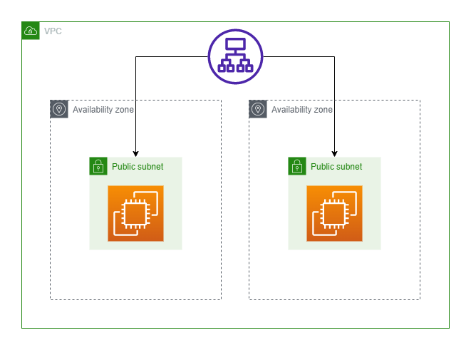

# Sample AWS Multi AZ Deployment with Terraform

Deploys a multi az setup in a Virtual Private Cloud (VPC), each availability zone (AZ) containing only a single public subnet and a single ec2 instance.

## Components
- VPC: An isolated private network boundary that is secure and hosted within AWS where you can provision resources inside.

- AZ: Comprises of one or more data centres in a region. Having multiple AZs mean that your application can have a failover if anything happens to a single data centre.

- Application Load Balancer: Distributes traffic (L7 HTTP/HTTPS) across it's targets. Useful when distributing workload across servers and ensuring equal workload.

- Public subnet: An subset of a VPC, it is also an isolated network boundary that is connected to the internet via an internet gateway.

- EC2 instance: A server / compute resource.

## Availability Improvements
1. Auto scaling groups to meet demand
2. Cloud native services such as Lambda / API Gateway

## Assumptions
1. No need to use security services such as WAF, Network Firewall, Macie, X-ray, Shield, etc
2. 2 AZs are enough to demonstrate availability and failover.
3. Web application is fundamental in nature and does not require a backend/database for this example.

## Troubles faced
1. Attempts to deploy a React app (static assets only) on EC2 failed due to an issue where the load balance distributes the calls wrongly due to `static/js/mainSOMEHASH.js` having a unique hash, resulting in error 404. See issue [here](https://stackoverflow.com/questions/73599420/how-to-update-react-apps-behind-an-aws-load-balancer-without-404-due-to-changing). A fix would be to deploy a cloudfront distribution, but that defeats the purpose of the architecture since the static files will that be cached in a S3 bucket. If somehow there is a fix for this issue, the script [here](https://github.com/TheSpaceCuber/react-hooks/blob/main/user_data.sh) will serve as ec2 user data to load up an instance properly.
 
